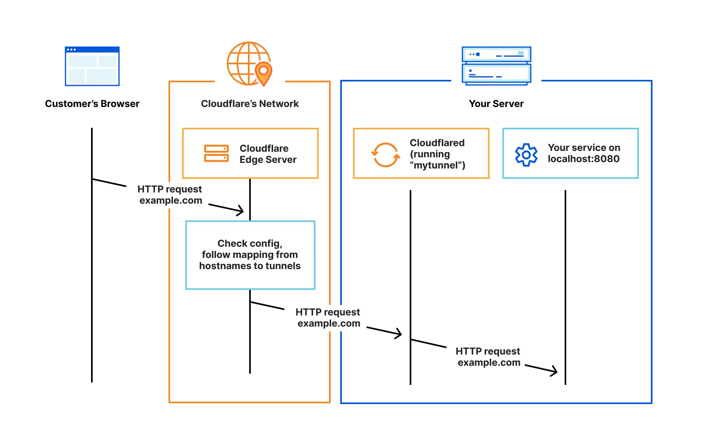

Cloudflare Tunnel provides you with a secure way to connect your resources to Cloudflare without a publicly routable IP address. With Tunnel, you do not send traffic to an external IP — instead, a lightweight daemon in your infrastructure (`cloudflared`) creates outbound-only connections to Cloudflare's global network. Cloudflare Tunnel can connect HTTP web servers, SSH servers, remote desktops, and other protocols safely to Cloudflare. This way, your origins can serve traffic through Cloudflare without being vulnerable to attacks that bypass Cloudflare.

## How it works

Cloudflared establishes outbound connections (tunnels) between your resources and Cloudflare's global network. Tunnels are persistent objects that route traffic to DNS records. Within the same tunnel, you can run as many 'cloudflared' processes (connectors) as needed. These processes will establish connections to Cloudflare and send traffic to the nearest Cloudflare data center.

## How to use
- https://developers.cloudflare.com/cloudflare-one/connections/connect-networks/get-started/
